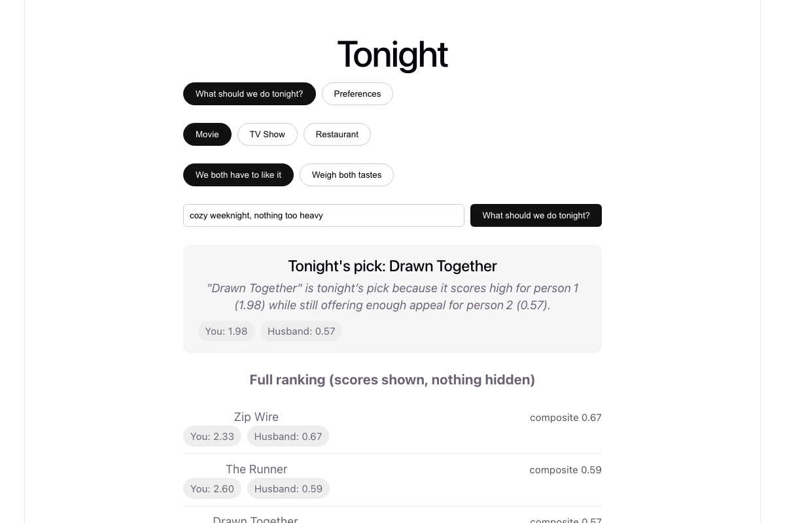
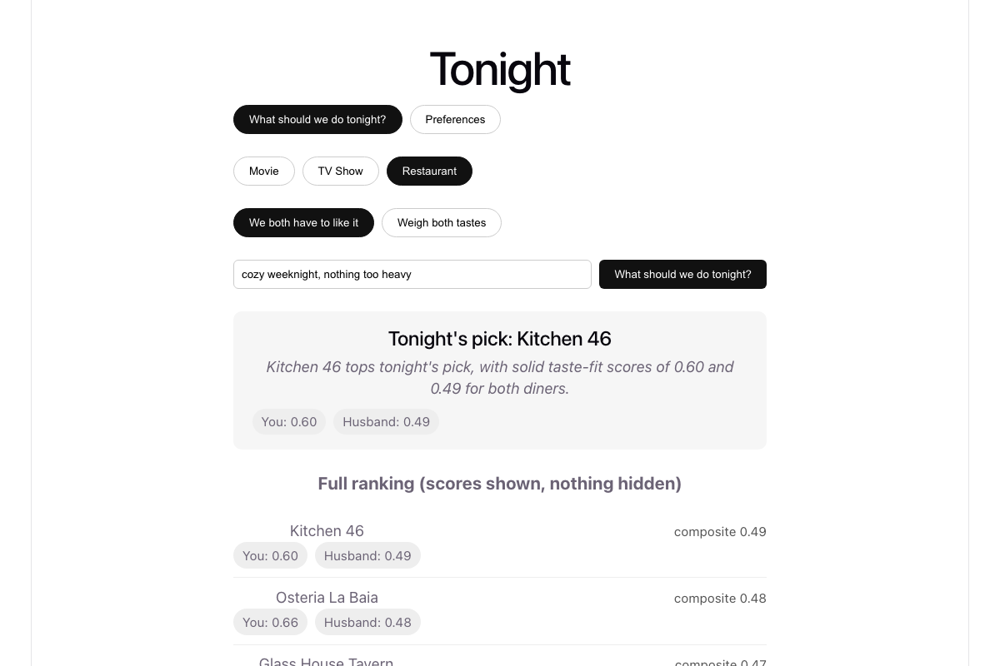
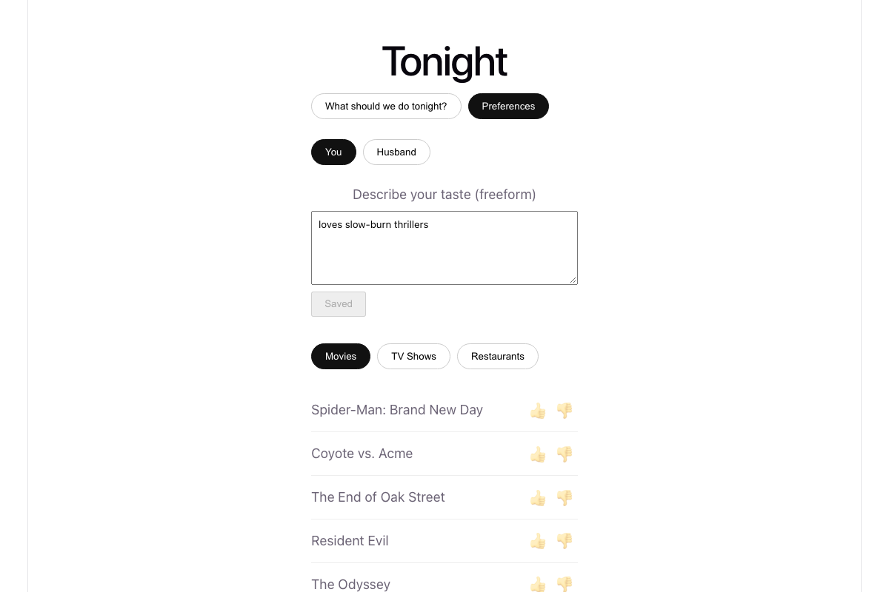

# Tonight


**A two-person recommendation engine that answers "what should we watch?"
and "where should we eat?" — built to show AI systems depth, not just an
LLM wrapper around a prompt.**

The core idea: ranking, filtering, and tie-breaking are treated as **typed
judgments** with calibrated probabilities behind them, not free text parsed
and hoped-for. A small purpose-built model ([TypeSafe](https://typesafe.ai)'s
Jev) does the decisions; an open-weight model (Groq) does the writing;
plain code does the policy. Nothing about *why* one option beat another is
buried in a paragraph of generated prose.



## Highlights

- **Typed judgment pipeline, not a prompt.** Every ranking decision traces
  to a `Score`/`Noul`/`Choice` answer with a probability distribution and a
  confidence value — inspectable, testable, versioned in code
  (`app/judgments/typesafe_client.py`), not a string buried in a request handler.
- **Two models, two jobs, on purpose.** A cheap, purpose-trained judgment
  model ranks and filters; a separate open-weight generation model
  (`openai/gpt-oss-20b` via Groq's free tier) only ever writes the "why this"
  blurb. Judgment and generation never share a model call — that separation
  is a deliberate architectural bet, documented below.
- **Composite policy lives in code, not a model.** "We both have to like
  it" (`min` across two people's scores) vs. "weigh both tastes" (mean) is
  a plain-code decision. Changing the policy is a diff, not a re-run of
  inference.
- **Score transparency by default.** Most recommendation demos hide the
  scoring behind a single "recommended for you" card. This one shows the
  full ranked list and every person's per-item score, unfiltered.
- **A real eval, run against the live pipeline.** `scripts/eval.py` scores
  16 hand-labeled scenarios in one batched API call and reports accuracy
  plus precision/recall — a regression check, not a one-off demo screenshot.
- **Two live third-party integrations wired end-to-end**: TMDB (movies/TV)
  and Google Places (restaurants) feed a real candidate pool — nothing here
  runs against mocked data.

## What it looks like

| Tonight's pick | Restaurant mode | Preferences |
|---|---|---|
|  |  |  |

## Architecture

```
TMDB API      ──┐
Google Places ──┼─► FastAPI backend ─► SQLite (items, ratings, notes, log)
                │         │
                │         ├─► TypeSafe (Jev): Score / Noul / Choice  ← the showcase
                │         │      - Score: per-user taste fit per candidate
                │         │      - Noul: hard filter (explicit dislikes/restrictions)
                │         │      - Choice: situational tie-break on the shortlist
                │         │
                │         └─► Groq (open-weight model): non-judgment text
                │                - explain *why* a rec was chosen (blurb)
                │                - parse a freeform preference note into tags
                │
                ▼
           React frontend (profile switch, rate items, freeform notes,
           "what should we do tonight" with full score transparency)
```

Composite scoring — combining both people's Score results into one ranked
list — happens **in plain code**, not a model call: `min()` of the two
scores for "we both have to like it" nights, mean for "weigh both tastes."
Policy changes (a new mode, a different tie-break rule) are a code change,
not a re-run of inference.

## Why TypeSafe for judgments, why Groq for generation

Two kinds of AI work show up in a recommendation app, and they don't belong
on the same model:

- **Ranking, filtering, tie-breaking are typed decisions.** "How excited
  would this person be about this movie" is a graded judgment with a
  calibrated probability distribution behind it — that's exactly what
  TypeSafe's Jev model is built for (a small, purpose-trained "System One"
  model, not a general LLM), and it's cheap enough to run per-candidate.
  Keeping this typed also means the *interface* is guaranteed: a `Score`
  answer always has a `.score` and a probability distribution, no parsing
  free text and hoping the number is in there.
- **Explaining a pick, or parsing a freeform note, is free-text generation.**
  There's no "correct probability" for a blurb. This runs on
  `openai/gpt-oss-20b` via Groq's free tier — an open-weight model, not a
  paid frontier LLM — because generation quality here doesn't need
  frontier-model reasoning, and it keeps the app's ongoing cost near-zero.

Separating these isn't just cost optimization — it's a legibility win.
Every ranking decision in this app can be traced to a typed Score/Noul/Choice
answer with a confidence value; nothing about *why* one movie outranked
another is buried in a paragraph of generated text.

## What the eval showed

`scripts/eval.py` runs 16 hand-labeled scenarios against the live judgment
pipeline in a single batched call: 9 Score scenarios (should this candidate
score high or low given a stated taste) and 7 Noul scenarios (should this
candidate be flagged as conflicting with an explicit dislike/restriction).

Latest run: **16/16 (100%) accuracy, Noul precision 1.00 / recall 1.00**,
using ~3.5K input tokens total. A few things worth calling out honestly:

- These scenarios are deliberately unambiguous (a shellfish allergy against
  a seafood restaurant, a stated horror-hater against a slasher movie) to
  validate baseline calibration, not edge cases. A harder eval — subtle
  genre overlaps, mixed signals between a note and rating history — is the
  natural next iteration and would be a more interesting number to report.
- 100% on an eval you wrote yourself is a floor, not a ceiling: it means the
  model does the obviously-right thing, not that it's well-calibrated on
  genuinely hard cases. Re-run this after any change to the question specs
  in `app/judgments/typesafe_client.py` — it's a regression check, not a
  one-time badge.

## A real gotcha hit during the build

`llama-3.1-8b-instant` (the originally planned Groq model) has since been
deprecated on Groq's side. Its replacement, `openai/gpt-oss-20b`, spends
hidden reasoning tokens before emitting visible content — at a tight
`max_tokens` budget the blurb generator was silently truncating to a single
word with no error. Fixed by setting `reasoning_effort: "low"` and giving
enough token headroom (400) for both the hidden reasoning and the visible
answer. Worth knowing if you're budgeting tokens tightly against any
`gpt-oss` model on Groq.

## Tech stack

**Backend:** Python, FastAPI, SQLModel, SQLite · **Frontend:** React, TypeScript, Vite
**AI:** [TypeSafe](https://typesafe.ai) (Jev — typed judgments), Groq (`openai/gpt-oss-20b` — generation)
**Data:** TMDB API (movies/TV), Google Places API (restaurants)

## Running locally

**Backend**
```bash
cd backend
python3 -m venv venv && source venv/bin/activate
pip install -r requirements.txt
cp .env.example .env   # fill in TMDB_API_KEY, GOOGLE_PLACES_API_KEY, TYPESAFE_API_KEY, GROQ_API_KEY
PYTHONPATH=. python scripts/seed_users.py
PYTHONPATH=. python scripts/sync_items.py
PYTHONPATH=. uvicorn app.main:app --reload
```

**Frontend**
```bash
cd frontend
npm install
npm run dev   # proxies /api/* to the backend on :8000
```

**Eval**
```bash
cd backend && source venv/bin/activate
PYTHONPATH=. python scripts/eval.py
```

## Data model

- `users` — 2 seeded rows
- `items` — `id, type [movie|tv|restaurant], external_id, title, item_metadata (JSON)`
- `ratings` — `user_id, item_id, value, created_at`
- `preference_notes` — `user_id, text, updated_at` (freeform taste description)
- `recommendation_log` — `created_at, context, results` — doubles as eval/history data

See `PLAN.md` for the original design doc and build order.
